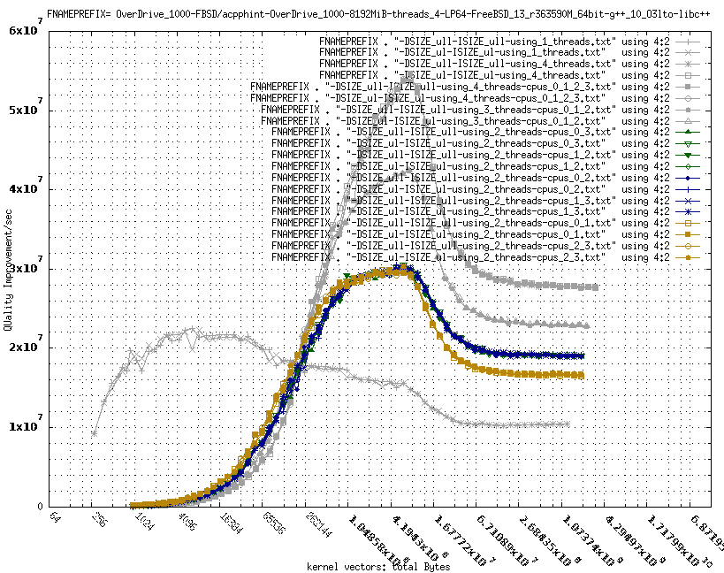
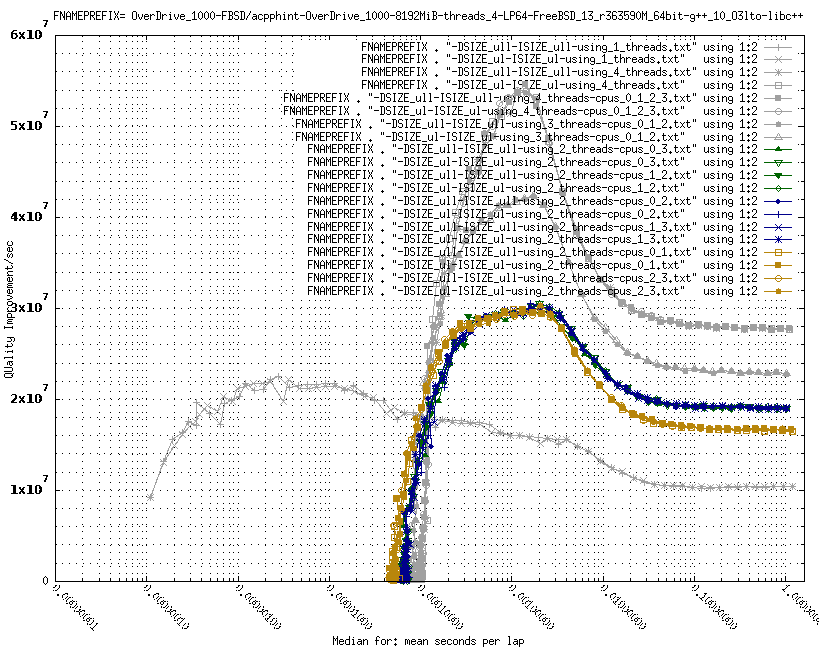

##### README.md for acpphint
This covers:
1.  What `acpphint` is a variation on . . .
2.  Where are the various README.md files?
3.  Licensing notes . . .
4.  Changelog . . .

##### What `acpphint` is a variation on . . .

`acpphint` is a variation on the original HINT serial and pthread benchmarks,
but written in C++ and with various choices specific to my use. The benchmark
program still generates files appropriate for gnuplot use, but not fully
matching the original HINT benchmark's output files.

I am not trying to collect/archive reports of results.

An example gnuplot from OverDrive 1000 example data was:


QUality ImProvement/sec (QUIPS) is based on Quality in a hierarchical
integration problem, Quality being `1/(high_bound-low_bound)`. So higher is
better. As the total size of the kernel vectors grows noticeably beyond a cache
size, the cache tends to become fairly ineffective. So the right hand side tends
to be more memory subsystem bandwidth limited for the stopping constraints that
I've used. (I used stopping-constraints that avoided using kernel vector sizes
that would cause paging, for example.)

`_ull` is for `unsigned long long`, `_ul` is for `unsigned long`. `DSIZE` is for
the Data Type. `ISIZE` is for the Indexing Type (not double or other floating
point types).

For more examples of this type of plot with some notes about the plots, see:

[Some acpphint curves with notes, QUIPS vs. RAM](Some_acpphint_curves_with_notes.md)

Another plot from the same data files was:


This tends to show the latency involved for small sized kernel vectors, where
single threaded does not measure any thread creation time or the like but the
multi-threaded cases do.

##### Where are the various README.md files?
The various README.md files are:
```
README.md                       (this file)
acpphint_src/README.md          (the main README.md)
acpphint_example_data/README.md (.gp gnulot usage too)
other_src_used/README.md        (other source code used)
```
(I normally have  a directory called `acpphint`  as the top of the tree of the
acpphint source distribution.) It is the `acpphint_src/README.md` that covers
how to build and how to run for the way the examples are set up. Material about
using the example data files is in: `acpphint_example_data/README.md` .

##### Licensing notes . . .
The various LICENSE.md files are:
```
LICENSE.md                (the overall license: GPLv2)
acpphint_src/LICENSE.md   (GPLv2 for HINT code variations)
acpphint_example_data/LICENSE.md (None for the example data)
other_src_used/LICENSE.md (OpenBSD-vintage-ISC source)
```
Overall, each `acpphint\*-NAME` program is licensed as GPLv2 (not earlier, not
later). But building the `acpphint related code does build some
OpenBSD-vintage-ISC licensed source files, those under `other_src_used/ instead
of under `acpphint_src/. Some resulting object files are linked into the
acpphint\*-NAME related programs (GPLv2 programs).

See the `acpphint_src/LICENSE.md` for the GPLv2 license text that applies to the 
files in `acpphint_src/` and to the binary files containing code from them. As I 
have the things structured, programs that do not have names that start with
`acpphint do not contain code from acpphint_src/` ( just from `other_src_used/` ).

See the `other_src_used/LICENSE.md` for the OpenBSD-vintage-ISC license text
that applies to just the source files in `other_src_used/` and to any binaries
not containing code from `acpphint_src/` source files.

Note: The original HINT's copyright holder, Iowa State University Research
Foundation, Inc., reported that, despite how HINT was mistakenly distributed
back then, the intended license was GPLv2 without any "or later" status: exactly 
GPLv2. This is what sets the license for the source code in `acpphint_src/`. (I
did not bother to make distinct licensing for the `acpphint_src/makefile.\*`
examples.) That code's license in turn sets the overall license to also be GLPv2 
(no earlier, no later), despite OpenBSD-vintage-ISC licensed source in
`other_src_used/` also being built and linked in.
##### Changelog . . .
###### [0.1.32] 2023-Feb-15         . . . 2023-???-?? (final)
Changes
- Have quips_peak and quips_to_peak_ratio updated in more cases.

###### [0.1.31] 2023-Feb-02+        . . . 2023-???-?? (final)
Additions
- Have the std::cout quips_to_peak_ratio line also report
  the numerator and denominator for the ratio so the quips
  and peak quips are explicitly visible as well.

Changes
- Later: Adjust/rename most g++_11 *.gp's to be g++_12 ones
  instead. Also, mostly avoid the runs involving a command
  line cpuset or schedctl style of run.

- Later: Adjust HoneyComb FreeBSD clang++ 15 make.*'s to
  identify modern FBSD vintage. Add files from runs to
  acpphint_example_data/HoneyComb-FBSD/ . Update *.gp's too.
  (One unrelated rename as well.)

Removals
- Later: Remove most older makefile.\*'s that do not match one of
  the now 12 \*.gp files at all. That includes clang++_12 files.

###### [0.1.30] 2023-Jan-31+        . . . 2023-???-?? (final)
Additions
- Add Fedora makefile.*'s for Running on a HoneyComb. Add
  files from a run in a new acpphint_example_data/HoneyComb-Fedora/
  directory for this combination.

- Later: add 2 such *.pg files. Adjust/rename a couple of others,
  adding time variants to the existing RAM ones as well.

- Later: Add a missing time *.gp file to go with a RAM one.

- Later: Add FreeBSD libstdc++ data, no *.gp files yet.

Removals
- Delete various unused HoneyComb FreeBSD g++ 11 based data files,
  now that a more modern FreeBSD/g++ combination has data files.

Changes
- Adjust a FreeBSD libstdc++ makefile.\*'s for Running on a HoneyComb.
  Add files from a run into acpphint_example_data/HoneyComb-FBSD/ .
  Also add *.gp files for this.

- Adjust FreeBSD libc++ makefile.\*'s for Running on a HoneyComb.
  (The variant for still using g++12.) No data files or *.gp files
  yet.

- Later: Add data files for libc++ .

- Later: Adjust libc++ related cpulockdown make.* file. Add files
  from a run into acpphint_example_data/HoneyComb-FBSD/ . No *.gp
  files for it yet.

- Later: Only have 3 NetBSD related *.gp files: Just for showing the
  NetBSD data oddities. Also use 10 for the time upper bounds in
  general for *.gp files, not 1.6.

- Later: Adjust/rename 3 g++_11 *.gp files to instead be g++_12 ones.

- Later: Modernize the FreeBSD libstdc++ make.* files to match the
  current context.

###### [0.1.29] 2023-Jan-30         . . . 2023-???-?? (final)
Additions
- Add NetBSD makefile.\*'s for Running on a HoneyComb. Add
  files from a run in a new acpphint_example_data/HoneyComb-NBSD/
  directory for this combination.

- Later: add such *.pg files. Also rescale in various *.gp files.

Changes
- Update other_src_used/sys_cpubinding.cpp to have support for
  cpu lock down for NetBSD.

- Update a couple of the HoneyComb FreeBSD make.*'s to add 2
  additional test runs, matching what NetBSD has.

###### [0.1.28] 2023-Jan-29         . . . 2023-???-?? (final)
Additions
- Add OpenBSD makefile.\* for Running on a HoneyComb with a
  kernel without DIAGNOSTIC variant of GENERIC. Add files from
  a run for this type of context.

- Add vectors_total_bytes/median_mean_sec_per_lap std::cout line.

###### [0.1.27] 2023-Jan-28         . . . 2023-???-?? (final)
Additions
- Add OpenBSD makefile.\*'s for Running on a HoneyComb. Add
  files from a run in a new acpphint_example_data/HoneyComb-OBSD/
  directory for this combination (but there are not any \*.gp
  files using them yet).

- Later: add a *.pg file that uses the 1, 2, and 4 thread
  OpenBSD data compared/contrasted with cpuset based FreeBSD
  data (but not with cpu lockdowns).

Changes
- Correct acpphint_src/Usage_differences_with_original_HINTs.md
  notes about how the command line arguments to acpphint are
  handled.

###### [0.1.26] 2022-Nov-21 (start) . . . 2023-???-?? (final)
Additions
- Add new Fedora 37 Server makefile.\*'s for Running on a
  2018 macMini under what macOS provides for a VM. Add files
  from runs in a new acpphint_example_data/2018macMiniVM-Fedora/
  directory for this combination (but there are not any \*.gp
  files using them yet).

- Later: Add the 2018macMniVM *.gp files. Also add the missing
  HoneyComb RAM vs_cpulockdown *.gp file.

- Later: Add makefiles, data files, and *.gp files for using
  g++/libc++ for the 2018macMiniVM . (g++ 12 as it turns out.)

Changes
- Make some \*.gp content more uniform.

- Update the .gitignore files, in part for future C++
  module experimentation.

- Later: removal of deleted data files from being gnerated by the
  makefile files for the 2018macMiniVM.

- Later: fix the libstdc++ spelling in the makefile.2018macMiniVM*
  names.

- Remove 2 misnamed 2018macMIniVM data files that are not to
  be regenerated.

###### [0.1.25] 2022-Aug-31 (start) . . . 2022-???-?? (final)
Additions
- Add some new HoneyComb makefile.\*'s, matching the more
  recent context (preliminary).

Changes
- Update the FreeBSD code in other_src_used/sys_cpubinding.cpp
  to use the newer FreeBSD CPU_AND macro (now 3 arguments, not
  2 arguments).

Removals
- Delete most of the \*.gp files and update to have just 12
  of the historical g++ 11 and clang++ 12 ones and 2 of the
  older OverDrive ones. MacchDblShot and RPi4B are only
  involved in Cortex-A72 comparisons, not by themselves. The
  ThreadRipper1950X data, HoneyComb data, and old OverDrive
  data are primary now.

- Delete lots of old \*.txt data files --and even some
  whole directories of such. Keep at least what is
  referenced by the 12 \*.gp files.

###### [0.1.24] 2021-Jul-06 (start) . . . 2021-Aug-28 (final)
Additions
- Add HoneyComb tests and related files.

- Add some code based on C++20 --and some C++17 that is
  now available: The output of the scales vs. the known
  approximation to the result now uses std::to_chars
  for the floating point output when available.

Changes
- A round of updating to more modern FreeBSD and, for
  the HoneyComb and the MACCHIATObin Double Shot, Fedora
  34. Only FreeBSD is tested in other contexts this time.

- Add/replace gnuplot .gp files (for exploring just
  the new data and the older OverDrive 1000 data
  that I've kept).

- Update to g++ 11 use.

- For just HoneyComb, also provide tests and supporting
  files for the main FreeBSD system clang++ (12).

- Update minor things in the sources to silence new
  warnings and the like.

- Update the FreeBSD "cpu lock down" code in
  other_src_used to work within just whatever cpuset
  is active for the process.

- Update various \*.md files to track what has been
  going on.

Removals
- The OverDrive 1000 and the other PowerMac11,2 "bit
  the dust". I've kept some plots around that involve
  the OverDrive 1000, with just the matching data files,
  but not the makefile.OverDrive\* files. The PowerMac
  files have all been removed.

- Other than the OverDrive 1000 files that I've kept,
  older example data files, makefile.\* files, \*.gp files,
  and the like have been removed.

###### [0.1.23] 2020-Aug-03 (start) . . . 2020-Oct-30 (final)
Additions
- Actually get the FreeBSD and Linux cpu lock down
  code to be part of such builds and make the code
  actually not be rejected. Also have it work. (I
  do not distribute binaries at all --nor that linux
  specific source, avoiding spending time on the
  additional licensing criteria that may be involved.
  But I've checked that such linux code is possible.)

- Add some FreeBSD head -r363590 data, g++10
  -O3 LTO based examples. (Exploring -O2, -O3, and
  -O3 -flto did not find great differences, but I
  stuck with the last that I tried.) Matching
  makefile.\* files and the like are involved.
  I still founds that g++ produced more performant
  benchmark code compared to clang++ for what I
  looked at.

- Add some Fedora 32 ThreadRipper 1950X data, g++10
  -O3 LTO based. Add some ubuntu 20.04.1 RPi4B data,
  g++9 -O3 LTO based.

- Add some gnuplot .gp files for exploring the new
  data.

Changes
- Update minor things in the sources to silence warnings
  after having added -Wpedantic -Wall -Wextra . Echo
  more information in the cout material, mostly explicit
  values in involved in the reported relationships.

Removals
- Older example data files, makefile.\* files, \*.gp files,
  and the like have mostly been removed. Some of the old
  makefile.\* files are around as examples.

- The PowerMac11,2 that allowed all memory slots to be
  used "bit the dust", as did the Pine64+ 2GB. As such
  I'm reverting to no coverage of old PowerMacs or the
  Pine64+ 2GB. (FreeBSD has 32-bit power pc messed
  up currently.)

###### [0.1.22] 2020-Jan-22
Additions
- Add FreeBSD head -r356426 data for Rock64,
  MacchDblShot, and OverDrive 1000. Add some gnuplot
  .gp files for comparing older examples with
  -r356426 based examples.

Changes
- Update various gnuplot .gp files to use FreeBSD
  head -r356426 based data.

Removals
- None.

###### [0.1.21] 2020-Jan-22
Additions
- Add FreeBSD head -r356426 powerpc64 (PowerMac11,2)
  results. This is an ELFv2 ABI context, instead of
  the ELFv1 context that the prior results were for.
  (No g++9 vs. system-libc++ ABI mismatches showed
  up, unlike for the earlier 32-bit powerpc test
  of -r356246 . 32-bit was not trying to update its
  ABI but did switch to the system being
  clang/clang++ based --a new mismatch resulted.)

Changes
- None.

Removals
- None.

###### [0.1.20] 2020-Jan-22
Additions
- Add RPi4B Ubuntu 19.10.1 server results.
  Added some ThreadRipper .gp files that had not
  not been checked in.

Changes
- Also updated to have the removal of a comment
  that for which the update had not been checked
  in.

Removals
- None.

###### [0.1.19] 2020-Jan-12
Additions
- Add dual socket PowerMac3,6 G4 data, but based on
  -maix-struct-return to match the odd(?) clang++ code
  generation for 32-bit powerpc. (May well have to
  replace later if clang++ is "corrected" (but that 
  would be another ABI change).

Changes
- Fix various typos and out of date comments.

Removals
- None.

###### [0.1.18] 2019-Dec-19
Additions
- Add FreeBSD pg_ps enabled example of stopping once
  having reached 6sec+ for the median trial time on the
  ThreadRipper 1950X. The previous examples were for
  pg_ps disabled (so large page mappings disabled).
  The 6+ seconds gets to a little under 95.77 GiBytes.

Changes
- None.

Removals
- None.

###### [0.1.17] 2019-Dec-18
Additions
- Copy prior ThreadRipper 1950X data to a directory
  for it being a re-run and put in place new data
  from a just-after-boot run for comparison.

Changes
- Where the original data is found.

Removals
- None.

###### [0.1.16] 2019-Dec-18
Additions
- Add STOPTM_ALT macro for using -DSTOPTM_ALT=... to
  compile-time control the median trial time stopping
  criterion. Also add NSAMP_ALT for using -DNSAMP_ALT=...
  in case it is needed to reach the STOPTM_ALT value.
  Add more ThreadRipper1950X example material based on
  using these. Still no .gp or .png for the
  ThreadRipper additions.

Changes
- Of course, the STOPTM_ALT and NSAMP_ALT additions
  are changes to acpphint_kernelsamplers.cpp .

Removals
- None.

###### [0.1.15] 2019-Dec-17
Additions
- Add examples from a FreeBSD ThreadRipper 1950X
  with 128 GiByte of RAM. BIOS (well, Ryzen Master)
  NUMA vs. nonNUMA for the same head -r355777 based
  build, also pg_ps enabled (large page mappings
  allowed) vs. disabled. No exploration of round
  robin or other such for NUMA: just defaults.

Changes
- None.

Removals
- None.

###### [0.1.14] 2019-Dec-02
Additions
- Add FreeBSD MACCHIATObin Double Shot vs.
  OverDrive 1000 and PowerMac11,2 .png files.

Changes
- None.
  
Removals
- None.

###### [0.1.13] 2019-Dec-01
Additions
- Add FreeBSD MACCHIATObin Double Shot vs.
  PowerMac11,2 .gp file.

Changes
- Correct 0.1.12 date.
  
Removals
- None.

###### [0.1.12] 2019-Dec-01-23
Additions
- Add FreeBSD MACCHIATObin Double Shot files,
  based on running in the 0.1.11 context.

Changes
- Adjust makefile.common_part to indicate v0.1.11 .
  
Removals
- None.

###### [0.1.11] 2019-Nov-23
Additions
- None.

Changes
- Have the FreeBSD vs. ArchLinuxARM comparison .gp
  file list FreeBSD first, ArchLinuxARM second in
  the plots. With sysctl dev.cpu.0.freq=1296 FreeBSD
  is faster in some contexts. Also rename the file
  to list FreeeBSD apects before the matching
  ArchLinuxARM aspects.
- Adjust makefile.common_part to indicate v0.1.11 .
  
Removals
- None.

###### [0.1.10] 2019-Nov-23
Additions
- None.

Changes
- Update Rock64 benchmark data to be based on
  manually having set: sysctl dev.cpu.0.freq=1296
- Adjust makefile.common_part to indicate v0.1.10 .
  
Removals
- None.

###### [0.1.9] 2019-Nov-23
Additions
- Add Rock64 .gp files. Note: The benchmark data
  indicates that FreeBSD is not changing from
  600MHz for the CPU to faster, such as around
  1200MHz. This looks to be manually adjustable
  so I'll likely get new benchmark data later.

Changes
- Adjust makefile.common_part to indicate v0.1.9 .
  
Removals
- None.

###### [0.1.8] 2019-Nov-23
Additions
- Add Rock64 FreeBSD 13 files, but not yet .gp files.
  These were counted as running under v0.1.7 .

Changes
- Adjust makefile.common_part to indicate v0.1.8 .
  
Removals
- None.

###### [0.1.7] 2019-Nov-21
Additions
- Add Rock64 .gp files.

Changes
- Adjust makefile.common_part to indicate v0.1.7 .
  
Removals
- None.

###### [0.1.6] 2019-Nov-21
Additions
- Add Rock64 example's material, no .gp files yet.

Changes
- Update future compiler options for MACCHIATObin
  and RPi4B to be explicit about the cpu types to
  target. Other minor text edits in the 2 makefiles.
  Materials were not regenerated.
- Adjust makefile.common_part to indicate v0.1.6 .
  
Removals
- None.

###### [0.1.5] 2019-Nov-16
Additions
- Add a .gp file (for gnuplot use) that compares
  a MACCHIATObin Double Shot to a Raspberry Pi 4B:
  Both have an A72, but with very different memory
  subsystems, as well as different cpu clock rates.

Changes
- Adjust makefile.common_part to indicate v0.1.5 .
  
Removals
- None.

###### [0.1.4] 2019-Nov-16
Additions
- Add iMac18,3 Corei5 example's material.
  (The .gp file, for gnuplot use, is untested.)

Changes
- Adjust makefile.common_part to indicate v0.1.4 .
  
Removals
- None.

###### [0.1.3] 2019-Nov-16
Additions
- Add MACCHIATObin double shot example's material.
  (The .gp file, for gnuplot use, is untested.)

Changes
- Adjust makefile.common_part to indicate v0.1.3 .
  
Removals
- None.

###### [0.1.2] 2019-Oct-12
Additions
- None beyond initial addition of files.

Changes
- Fix a typo in README.md to explore making a change.
- Adjust makefile.common_part to indicate v0.1.2 .
  
Removals
- None.
