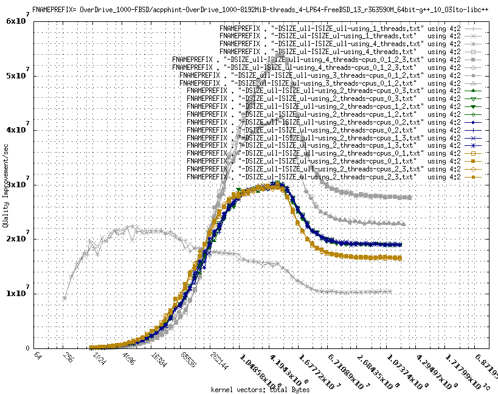
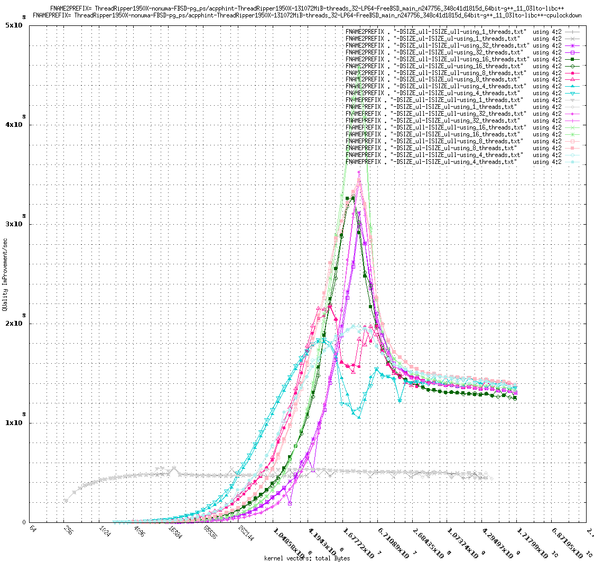

##### Some_acpphint_curves_with_notes.md
This covers:

0. Cortex-A53 cores with and without smaller cache level(s) being shared
   (old OverDrive 1000 example, repeated cpu migration allowed)
1. ThreadRipper 1950X: 1CCD 1CCX 2/4 hardware threads
   (SMT pairs being used vs. not; SMT pairs also share smaller cache levels)
2. ThreadRipper 1950X: 1CCD 2CCX 2/4 hardware threads
   (SMT pairs being used vs. not; SMT pairs also share smaller cache levels)
3. ThreadRipper 1950X: 2CCD 2CCX 2/4 hardware threads
   (no SMT pairs being used for 2 hardware threads)
4. ThreadRipper 1950X: no process cpuset restriction 4/8/16/32 hardware threads
   (no SMT pairs being used, except for for 32 hardware threads using them all)

This document presumes familiarity with some material from:

##### Cortex-A53 cores with and without smaller cache level(s) being shared . . .
In this plot:

0. The dark goldenrod curves are for smaller RAM cache levels being shared.
1. The dark blue curves are for no RAM cache levels shared.
2. The dark grey curves are just for a sense of scale vs. single threaded and
   3..4 (hardware) threads.

The type of build used allowed repeated core migrations within whatever cpuset
the process was assigned. The curve names identify the FreeBSD CPUs assigned.

Effects of competing for the shared RAM cache level(s) can be seen:

0. Thread creation takes somewhat less time.
   (left side of goldenrod vs. blue curves)
1. Computing is somewhat slower.
   (right side of goldenrod vs. blue curves)

This will contrast with the ThreadRipper 1950X SMT pairs.

Notes:

0. The x and y ranges for plotting are different from the later ThreadRipper
   1950X examples.
1. The data is older because the OverDrive 1000 "bit the dust".

##### ThreadRipper 1950X: 1CCD 1CCX 2/4 hardware threads
In this plot:

0. Pink and Magenta are for 2 (hardware) threads.
1. Goldenrod and Blue are for 4 (hardware) threads.
2. Pink and Goldenrod are for SMT pairs being used (0/1, 0/1/4/5).
3. Magenta and Blue are for SMT pairs being avoided (0/2, 0/4, 0/2/4/6).
4. Dark curves (non-grey) are for repeated thread migration allowed within the
   process's cpuset.
5. Light curves are for no migration after the initial migration just after
   thread creation (within the process's cpuset).
6. The dark grey curves are just for a sense of scale vs. single threaded and
   2CCD 2CCX 4 (hardware) threads (0/8/16/24, avoiding repeated migration).

One type of build used allowed repeated core migrations within whatever cpuset
the process was assigned. The "-cpulockdown" builds migrate to a specific, singleton FreeBSD thread cpuset just after thread creation. The curve names help identify the FreeBSD CPUs assigned but are likely not obvious.

For the 1CCD 1CXX type of context there is little difference.

The big distinction for 1CCD 1CCX, for a given number of (hardware) threads, is
based on SMT pairs use (and the matching smaller-cache-level sharing) vs. not
involving such SMT pairs.

The combined effects of SMT pair use and competing for the shard RAM cache
level(s) can be seen to have a large effect: SMT pair use is far slower than
avoiding such use.

Notes:

0. The x and y ranges for all the plots for 1950X CCD/CCX 2/4 thread
   combinations are the same, making comparison/contrast easier.

##### ThreadRipper 1950X: 1CCD 2CCX 2/4 hardware threads
In this plot:

0. Pink and Magenta are for 2 (hardware) threads.
1. Goldenrod and Blue are for 4 (hardware) threads.
2. Pink and Goldenrod are for SMT pairs being used (0/1/8/9).
3. Magenta and Blue are for SMT pairs being avoided (0/8, 0/2/8/10, 0/4/8/12).
4. Dark curves (non-grey) are for repeated thread migration allowed within the
   process's cpuset.
5. Light curves are for no migration after the initial migration just after
   thread creation (within the process's cpuset).
6. The dark grey curves are just for a sense of scale vs. single threaded and
   2CCD 2CCX 4 (hardware) threads (0/8/16/24, avoiding repeated migration).

One type of build used allowed repeated core migrations within whatever cpuset
the process was assigned. The "-cpulockdown" builds migrate to a specific,
singleton FreeBSD thread cpuset just after thread creation. The curve names help identify the FreeBSD CPUs assigned but are likely not obvious.

For the 1CCD 2CXX type of context there is a significant difference for sizes
of 1 MiByte or 4 MiByte to 32 MiByte or so: normal thread migration slows things 
down greatly over much of that range.

But the biggest distinction for 1CCD 2CCX, for a given number of (hardware)
threads, is still based on SMT pairs use (and the matching
smaller-cache-level sharing)  vs. not involving such SMT pairs.

Notes:

0. The x and y ranges for all the plots for 1950X CCD/CCX 2/4 thread
   combinations are the same, making comparison/contrast easier.

##### ThreadRipper 1950X: 2CCD 2CCX/4CCX 2/4 hardware threads
In this plot:

0. Pink and Magenta are for 2 (hardware) threads.
1. Goldenrod, Blue, and Green are for 4 (hardware) threads.
2. Goldenrod is for SMT pairs being used (0/1/16/17).
3. Magenta, Blue, and Green are for SMT pairs being avoided
   (0/16, 0/2/16/18, 0/4/16/20, 0/8/16/24).
4. Dark curves (non-grey) are for repeated thread migration allowed within the
   process's cpuset.
5. Light curves are for no migration after the initial migration just after
   thread creation (within the process's cpuset).
6. The dark grey curves are just for a sense of scale vs. single threaded.

One type of build used allowed repeated core migrations within whatever cpuset
the process was assigned. The "-cpulockdown" builds migrate to a specific,
singleton FreeBSD thread cpuset just after thread creation. The curve names help identify the FreeBSD CPUs assigned but are likely not obvious.

For the 2CCD 2CXX type of context there is a significant difference for sizes
of 1 MiByte or 4 MiByte to 32 MiByte or so: normal thread migration slows things 
down greatly over much of that range.

But the biggest distinction for 2CCD 2CCX/4CXX, for a given number of (hardware)
threads, is still based on SMT pairs use (and the matching
smaller-cache-level sharing)  vs. not involving such SMT pairs.

Notes:

0. The x and y ranges for all the plots for 1950X CCD/CCX 2/4 thread
   combinations are the same, making comparison/contrast easier.
1. The light green curves were light grey in the other 1950X 2/4 thread
   plots.

#####  ThreadRipper 1950X: no process cpuset restriction 4/8/16/32 hardware threads
In this plot:

0. Turquoise is for 4 (hardware) threads (0/8/16/24).
1. Pink is for 8 (hardware) threads (0/4/8/12/16/20/24/28).
2. Green is for 16 (hardware) threads (0/2/4/6/8/10/12/. . ./28/30).
3. Magenta is for 32 (hardware) threads (0/1/2/3/. . ./28/29/30/31).
4. Dark curves (non-grey) are for repeated thread migration allowed.
5. Light curves are for no migration after the initial migration just after
   thread creation.
6. The dark grey curves are just for a sense of scale vs. single threaded.

One type of build used allowed repeated core migrations. The "-cpulockdown"
builds migrate to a specific, singleton FreeBSD thread cpuset just after thread
creation. The curve names do not identify the FreeBSD cpus used.

For the 2CCD 2CXX/4CXX type of context with 4 or 8 (hardware) threads there is a 
significant difference for sizes of 8 MiByte to 64 MiByte or so:
normal thread migration slows things down greatly over much of that range. The
16 (hardware) threads case is also noticeably slower over such a range. 32
also, but it has another issue . . .

Another distinction for 2CCD 2CCX/4CXX shown is for 32 (hardware) threads:
32 is also based on SMT pairs use (and the matching sharing of sufficiently
smaller cache levels).

Notes:

0. The y range for this plot is not the same as for the other 1950X plots.